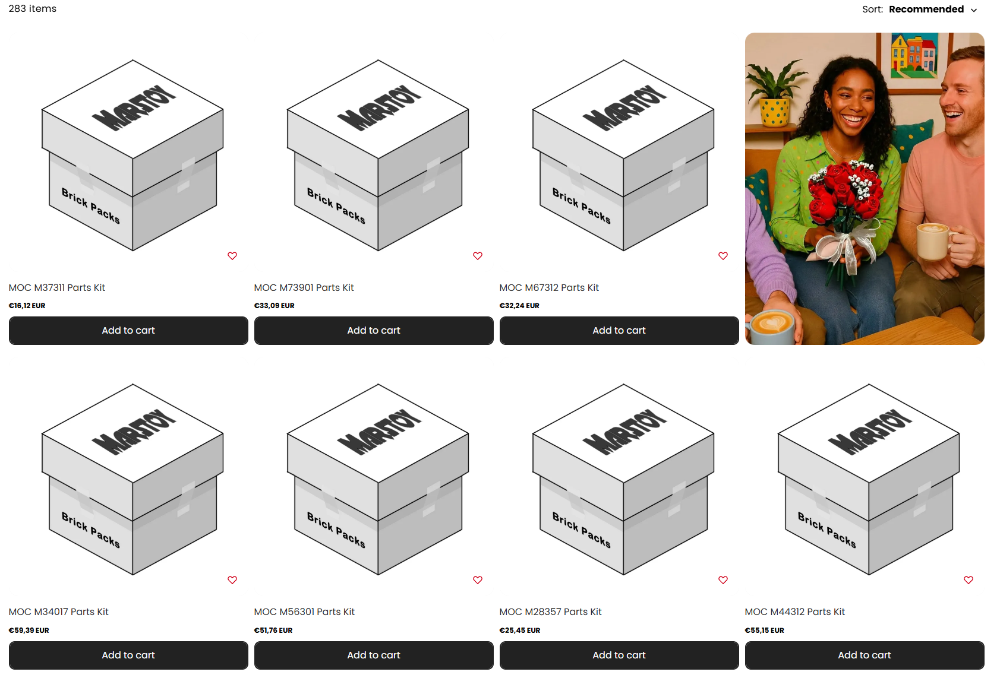
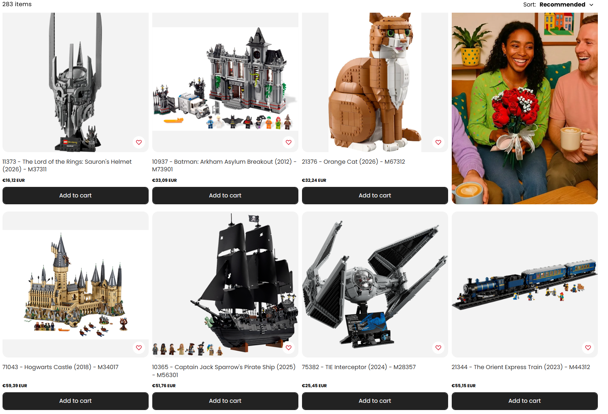
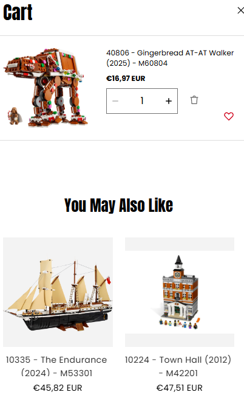
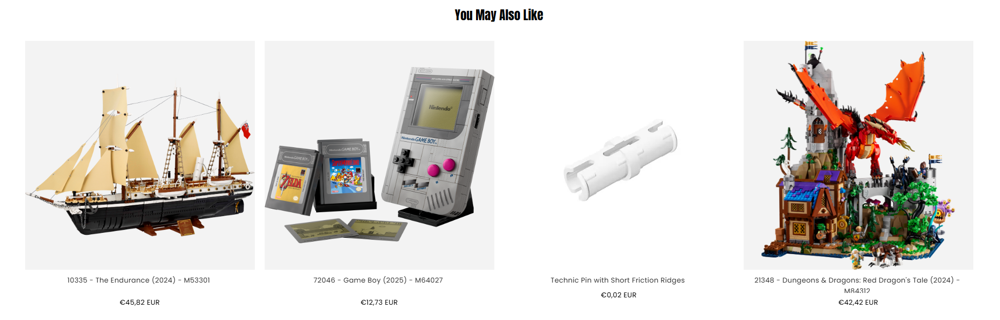
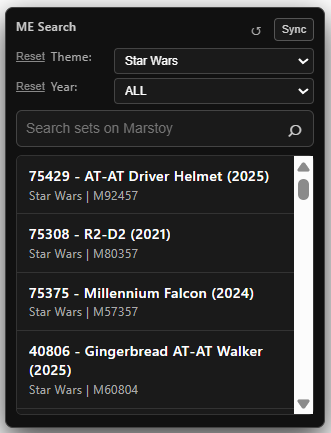
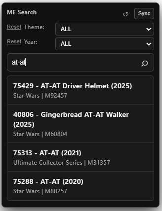
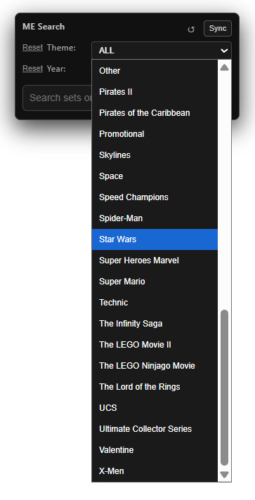
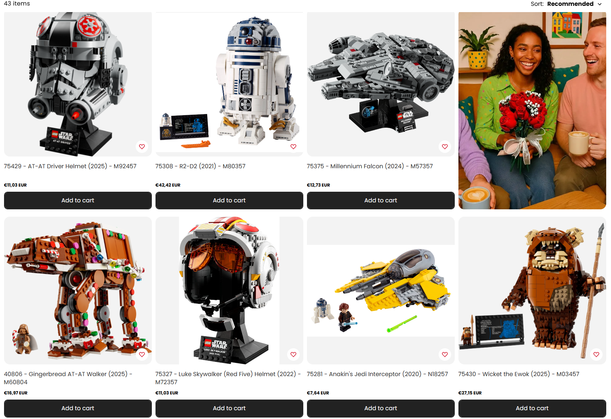

# Marstoy Enhancer

This Chrome extension enhances product pages on [marstoy.com](https://marstoy.com) by improving product titles and images, and by adding **ME Search** for fast local catalog browsing and filtering.

> This project is not affiliated with Marstoy.

---

## What It Does

- Automatically replaces titles like  
  `MOC M54321 Parts Kit`  
  with  
  `12345 - Nice name (2025) - M54321`

- Works with both `M` and `N` formatted IDs, such as `M54321` and `N54321`

- Replaces **titles and images** on:
  - Product listing pages
  - Product detail pages
  - Cart drawer
  - You may also like

- Adds **ME Search**, a fast local search window for browsing the Marstoy catalog by name, product ID, theme, or year

---

### BEFORE  

### AFTER  

  
  

---

## ME Search

**ME Search** is an integrated, offline search panel for Marstoy.

### Features
- Works instantly and **completely offline** with no API or server calls
- Supports **partial matching**:
  - Name → `death star`
  - Product ID → `12345`, `M54321` (Lego ID or Marstoy ID)
  - Theme → `star wars`, `ultimate collector series`
  - Year → `2025`

  
  
  

### Full-page search
If you enter, for example, a theme name and press Enter or click the search icon, Marstoy will show all matching products in that theme.

### Clicking results
When you click a search result:
- It opens the corresponding product directly on Marstoy.

### Cache cooperation
- ME Search results come directly from your **Marstoy cache**.
- When you sync **Marstoy products cache**, new sets appear instantly in ME Search.
- The cache persists between sessions. Refresh it manually if new products appear on Marstoy.

---

## Extension Menu

Clicking the extension icon opens the **popup menu**:

| Section | Description |
|----------|--------------|
| **Status** | Shows the current extension activity or sync progress |
| **Sync Rebrickable catalog** | Refreshes the local LEGO dataset from built-in Rebrickable exports |
| **Sync Marstoy products cache** | Updates the mapping of Marstoy product IDs to LEGO sets |
| **Show ME Search** | Toggles whether the ME Search window is visible on Marstoy pages |
| **Github · vX.Y.Z** | Links to this repository, shows the installed version, and indicates when a newer version is available |

---

## How It Works

### No API key required
- You no longer need a Rebrickable API key.
- The extension works completely offline using local data files bundled with the extension.

### Data sources
- Product information such as set names, numbers, years, and themes comes from a **Rebrickable dataset export** included in the extension as `.csv` files.
- The extension reads this static data locally and does not query Rebrickable servers.
- **Sync Rebrickable catalog** refreshes the cached LEGO catalog data from the bundled exports.
- **Sync Marstoy products cache** rebuilds the mapping between Marstoy products and LEGO sets.

### Local cache
- All processed data is stored in `chrome.storage.local`.
- Once loaded, it is immediately available on Marstoy pages without additional requests.
- You can run sync again at any time to refresh the cache.

### Image Loading
- Product images are loaded from Rebrickable data first. If an image is missing or unavailable, the extension automatically falls back to BrickLink.

---

## Installation (Chrome/Brave)

1. **Download** this repository as a `.zip` or get it from [Releases](https://github.com/KostraTech/MarstoyEnhancer/releases)

2. **Extract** the ZIP file to a folder.

3. Open **Chrome/Brave → `chrome://extensions/` or `brave://extensions/`**

4. Enable **Developer mode**

5. Click **Load unpacked** and select the extracted folder.

6. The extension will appear in your toolbar. Pin it if you want quick access.

---

## Notes & Recommendations

- **Sync occasionally**, because new Marstoy products appear regularly.
- **Clear cache** via Chrome DevTools or an extension reset if something looks outdated.
- Use **Show ME Search** to show or hide the search panel as needed.

---

## Credits

- Original idea by [BjornstadThomas](https://github.com/BjornstadThomas/MarstoyIdConverter-Extension)
- Code improved and maintained with AI-assisted development.

---

## License

MIT License — feel free to fork, modify, and share.  
Use at your own risk.
