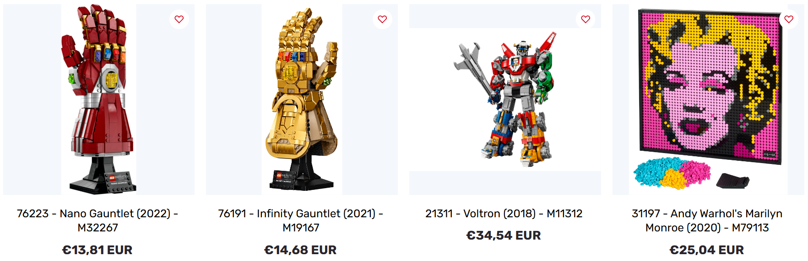

# 🧩 Marstoy Enhancer – Rebrickable Integration

This Chrome extension enhances product pages on [marstoy.com](https://marstoy.com) by automatically fetching **official LEGO set names, images, and release years** from [Rebrickable](https://rebrickable.com) using their public API.

> ⚠️ This project is not affiliated with Marstoy or Rebrickable. It’s a personal utility extension, originally inspired by [BjornstadThomas/MarstoyIdConverter-Extension](https://github.com/BjornstadThomas/MarstoyIdConverter-Extension) (which is no longer functional).

---

BEFORE

AFTER

---

- ✅ Automatically replaces titles like  
  `MOC M12345 Parts Kit`  
  with  
  `54321 - Nice name (2025) - M12345`

- ✅ Works with both `M` and `N` formatted IDs (e.g. `M12345`, `N12345`).

- ✅ Replaces **titles and images** on:
  - Product listing pages (collections)
  - Product detail pages
  - Cart page
  - “You may also like” and “Recently viewed” sections

- 🕒 Smart **caching & retry system** to avoid hitting API limits:
  - **1st attempt**: immediately  
  - **2nd attempt**: after 2 seconds  
  - **3rd attempt**: after 60 seconds  
  - ❌ No further attempts until the page is refreshed or navigated away.
  
- 📸 Replaces product images with official Rebrickable images.  
- 🚫 Disables Marstoy’s default image hover zoom (to prevent display glitches).  
- 🌐 English is recommended as your Marstoy site language — product names are always fetched in English.

---

## ⚠️ API Rate Limiting (429 Errors)

Rebrickable has a **daily and per-minute request limit**.

If you open many pages or product listings at once, you may hit their **HTTP 429 (Too Many Requests)** limit. When this happens:

- Images and titles might temporarily stop updating.
- Wait **about 1 minute** — the extension will automatically retry the failed products after the cooldown.
- Alternatively, refresh the page after a minute.

---

## 🧠 How It Works

- The extension looks for product IDs in Marstoy URLs and titles.  
- It reverses the ID (Marstoy encodes them backwards), queries Rebrickable’s API once per unique ID, and **caches the result** in `chrome.storage.local`.
- Cached products never trigger another API call during the same session.
- The product title is replaced with the format:SetNumber - SetName (YearRelease) - M/N ID

---

## 🚫 What’s Not Modified

- The **Marstoy homepage** (flash sale / they’re back sections) is not affected.  
  Attempts to patch it caused breakages elsewhere, so it’s intentionally left untouched.
- **Wishlist**

---

## 🧰 Installation (Chrome)

1. **Download this repository** as a `.zip` or **Download from [Releases](https://github.com/KostraTech/MarstoyEnhancer/releases)**
   (or `git clone` if you prefer).

2. **Extract** the ZIP file to a folder on your computer.

3. Open **Chrome** and go to  
   `chrome://extensions/`

4. In the top-right, enable **Developer mode** 🧑‍💻

5. Click **“Load unpacked”** and select the folder where you extracted the extension.

6. The extension will appear in your toolbar (you can 📌 pin it manually via the puzzle icon).

---

## 🔑 Rebrickable API Key Setup

To use the extension, you’ll need a **free Rebrickable API key**.

1. Go to [https://rebrickable.com](https://rebrickable.com)  
2. Create an account or log in.
3. Navigate to **Settings → API**.
4. Copy your **API Key**.
5. Click the extension icon in Chrome, paste the key into the input field, and hit **Save**.

Your key is stored **locally in `chrome.storage.local`** (never sent anywhere else).  
The input is masked by default — click the 👁 icon to show/hide the key temporarily.

---

## 📝 Notes & Recommendations

- 🟡 **Set your Marstoy language to English** for best results.  
  Rebrickable data is returned in English, so this keeps names consistent.

- 🧼 **Clear cache** (via Chrome extension storage) if you suspect stale data.

- 💡 If titles/images stop loading, wait ~1 minute (API limit), then refresh.

- ⚠️ This is not a production-grade extension — it’s a functional utility built with the help of AI.

---

## 🧠 Credits & Acknowledgments

- Original concept: [BjornstadThomas/MarstoyIdConverter-Extension](https://github.com/BjornstadThomas/MarstoyIdConverter-Extension)  
- Code was **generated and iterated using AI**, then adapted and tested manually.  
- This extension is not affiliated with Marstoy or Rebrickable.

---

## 🛠️ Customization

Feel free to **fork, modify, and adapt** this extension to your own needs.  
The code is intentionally simple and not minified, so you can tweak selectors, caching behavior, or API handling to fit your preferences.

---

## 📜 License

MIT License — feel free to fork, modify, and share.  
Use at your own risk.
