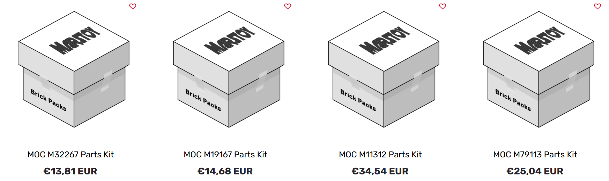

# 🧩 Marstoy Enhancer

This Chrome extension enhances product pages on [marstoy.com](https://marstoy.com) - improving product titles, images, and providing a powerful **ME Search** system for local catalog browsing and filtering.

> ⚠️ This project is not affiliated with Marstoy.  

---

### BEFORE  

### AFTER  

---

## 🚀 What It Does

- ✅ Automatically replaces titles like  
  `MOC M12345 Parts Kit`  
  with  
  `54321 - Nice name (2025) - M12345`

- ✅ Works with both `M` and `N` formatted IDs (e.g. `M12345`, `N12345`).

- ✅ Replaces **titles and images** on:
  - Product listing pages (collections)
  - Product detail pages
  - Cart page
  - “You may also like” and “Recently viewed” sections

- ✅ Adds a new **ME Search** feature - a local, instant search window  
  that lets you filter and search through all known Marstoy products.

---

## 🧠 How It Works

Unlike older versions, the current version of **Marstoy Enhancer**  
**no longer uses any live API calls.**

### 🔒 No API key required
- You don’t need a Rebrickable API key anymore.  
- The extension now works **completely offline**, using local data files bundled within the extension.

### 📦 Data sources
- Product information (set names, numbers, years, and themes) is taken from a **Rebrickable dataset export**, included in the extension as `.csv` files.  
- The extension **does not request data from Rebrickable servers** - it reads from these static datasets directly.
- When you click **“Sync Rebrickable catalog”**, it refreshes the cached LEGO catalog data from these built-in exports.
- When you click **“Sync Marstoy products cache”**, it rebuilds the mapping between Marstoy products and LEGO sets.

### 💾 Local cache
- All processed data is stored in `chrome.storage.local`.
- Once loaded, it’s instantly accessible on any Marstoy page without reloading or network requests.
- Cache updates are fast and safe - you can sync again anytime to refresh data.

---

## 🖼️ Image Loading and Fallback

Each product image is validated and fetched intelligently:

| Step | Action |
|------|---------|
| 🟢 **Primary load** | Loads the official Rebrickable-style image from the Marstoy CDN or dataset
| 🔄 **Retry** | If not loaded after 2 seconds, tries again or checks if image is missing (404)
| 🧩 **Fallback** | If still missing or broken, automatically switches to an image from **BrickLink** (`img.bricklink.com`)
| 🛑 **End** | Stops all retries and cleanup

This ensures that:
- Broken or missing images are replaced with **BrickLink images** whenever possible.  
- If BrickLink doesn’t have the image, the placeholder remains, but retries stop after 5 seconds to avoid flicker.

---

## 🧰 Extension Menu

Clicking the extension icon opens the **popup menu**, which includes:

| Section | Description |
|----------|--------------|
| **Status** | Shows the current extension activity or sync progress |
| **Sync Rebrickable catalog** | Refreshes the local LEGO dataset (set names, years, themes) from built-in Rebrickable exports |
| **Sync Marstoy products cache** | Updates the mapping of Marstoy product IDs to LEGO sets |
| **Show ME Search** | Toggles whether the ME Search window is visible on Marstoy pages |
| **Github · vX.Y.Z** | Link to this repository and current installed version |

---

## 🔎 ME Search

**ME Search** is an integrated, offline search panel for Marstoy.  

It uses the locally cached dataset to search across the entire catalog.

### ✨ Features
- Works instantly and **completely offline** (no API, no server calls)
- Supports **partial matching**:
  - Name → `death star`
  - Product ID → `M12345`, `N54321`
  - Theme → `star wars`, `ultimate collector series`
  - Year → `2025`
- Displays all matching results live as you type.

### 🔗 Clicking results
When you click a search result:
- It opens the corresponding product directly on Marstoy.
- The link is built from cached product data - no network lookup required.

### 🔍 Full-page search
- If you press Enter or click the search icon, ME Search will redirect you to the Marstoy search page showing all matching products.

### ⚙️ Cache cooperation
- ME Search results come directly from your **Marstoy cache**.
- When you sync **Marstoy products cache**, new sets appear instantly in ME Search.
- The cache stays persistent between sessions - refresh it manually if new products appear on Marstoy.

---

## 🧩 Technical Notes

- The extension replaces Marstoy titles and images using **local cache data**, not API calls.
- Images are fetched intelligently with fallback to BrickLink.
- Smart retry logic ensures consistent loading even on slow connections.
- Everything runs in the browser - **no external requests** after installation.

---

## 🧰 Installation (Chrome)

1. **Download** this repository as a `.zip` or get it from [Releases](https://github.com/KostraTech/MarstoyEnhancer/releases)  
   (or clone via `git clone`).

2. **Extract** the ZIP file to a folder.

3. Open **Chrome → `chrome://extensions/`**

4. Enable **Developer mode**

5. Click **“Load unpacked”** and select the extracted folder.

6. The extension will appear in your toolbar - pin it if you wish.

---

## 🧠 Notes & Recommendations

- 🟡 **Sync occasionally** - new Marstoy products appear regularly.
- 🧼 **Clear cache** (via Chrome DevTools or extension reset) if something looks outdated.
- 🔍 **Use “Show ME Search”** toggle to show/hide the search panel as needed.
- 🌍 Works best when your Marstoy language is set to English.

---

## 🧠 Credits

- Original idea by [BjornstadThomas](https://github.com/BjornstadThomas/MarstoyIdConverter-Extension)  
- Code improved and maintained with AI-assisted iteration

---

## 📜 License

MIT License — feel free to fork, modify, and share.  
Use at your own risk.
